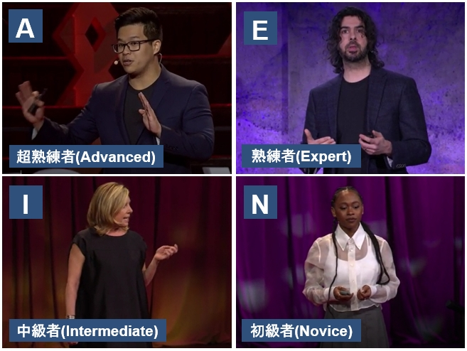

# プロジェクト(Project)
　数理人材育成協会HRAM(Human Resource Association of Mathematics)主催の
AIエキスパート人材育成コースで実施したスピーチ動作の評価モデル研究の成果である。
本コースではロボティックス関連の高野研究室に所属している。
本研究では、TEDサイトのスピーチ動画から話者の骨格座標及び音声を抽出し、
それら時系列データをAIモデルで処理することによりスピーチ動作の良し悪し判定を行うものである。
コース期間は2024年6月から約1年間であり最終的に学会及び公聴会での発表が必須である。 

This is the result of research on a speech movement evaluation model conducted 
in the AI Expert Human Resource Development Course organized by the Human Resource Association of Mathematics (HRAM).
In this course, the author belongs to Professor Takano’s Robotics Laboratory.
In this study, skeletal coordinates and audio are extracted from TED speech videos,
and by processing these time-series data with an AI model, the quality of speech movements is evaluated.
The course runs for about one year starting in June 2024, 
and a final presentation at an academic conference and a public hearing is mandatory. 

## プログラム及びデータ概要(Program and Data Overview)
<11_データセット作成> 
11a_Movenet_mp4topnkp.py：mp4動画からmovenetで骨格座標を抽出する 
11b_pnkp+Audio.py：mp3から音声データを抽出しフレーム同期させる 
11c_10sec_samples.py：骨格座標と音声データのテーブルから特定条件の10秒間のデータを抽出する 
12a_XXsec_samples.py：骨格座標と音声データのテーブルから特定条件(*1)の連続秒数最大のデータを抽出する 
12b_1secSW_samples.py：一連連続データサンプルからスライディングウィンドウ(1秒)サンプルを作成 
12c_XsecSW_samples.py：一連連続データサンプルからスライディングウィンドウサンプルを作成 
13a_LeftWrist_fixed.py：左手首固定のMovenet骨格座標データ作成 
13b_RightWrist_fixed.py：右手首固定のMovenet骨格座標データ作成 
13c_BothWrists_fixed.py：両手首固定のMovenet骨格座標データ作成 
13d_AudioStrength_fixed.py：音声データ固定の時系列データ作成、骨格座標はそのまま 
15a_Dataset_download.py:データセットダウンロード 
<21_学習評価> 
21_transformer_encoder.py：4値分類学習、評価 
<設定ファイル:data2> 
conf.csv：動画mp4データのフレームレート 
label.csv：学習データラベル 
results.csv：テストデータラベル 

<11_Dataset Creation> 
11a_Movenet_mp4topnkp.py: Extract skeletal coordinates from mp4 videos using Movenet 
11b_pnkp+Audio.py: Extract audio data from mp3 and synchronize it with frames 
11c_10sec_samples.py: Extract 10-second data under specific conditions from the table of skeletal coordinates and audio data 
12a_XXsec_samples.py: Extract the longest continuous sequence under specific conditions (*1) from the skeletal coordinate and audio data table 
12b_1secSW_samples.py: Create sliding window (1 sec) samples from continuous data samples 
12c_XsecSW_samples.py: Create sliding window samples from continuous data samples 
13a_LeftWrist_fixed.py: Generate Movenet skeletal coordinate data with left wrist fixed 
13b_RightWrist_fixed.py: Generate Movenet skeletal coordinate data with right wrist fixed 
13c_BothWrists_fixed.py: Generate Movenet skeletal coordinate data with both wrists fixed 
13d_AudioStrength_fixed.py: Create time-series data with fixed audio strength, keeping skeletal coordinates unchanged 
15a_Dataset_download.py: Dataset download 
<21_Training and Evaluation> 
21_transformer_encoder.py: 4-class classification training and evaluation 
<Configuration file: data2> 
conf.csv: Frame rate of mp4 video data 
label.csv: Training data labels 
results.csv: Test data labels 

## 入力データセット(Input Dataset)
関連リンク記載のHuggingFaceにデータセットが格納されている。 
プログラムにより、フォルダcsv_recoveredに下記フォルダが作成されてcsvファイルがダウンロードされる。 
※実行前に、HuggingFaceのトークンをHUGGINGFACE_HUB_TOKENへ設定しておく。 
フォルダcsv_recoveredをフォルダdata_csvへリネームする。 
学習データ(train[7054サンプル]/test[255サンプル]) 
評価データ(eva[63サンプル]) 
学習データにはデータ増強サンプルも全て含まれている。 

The dataset is stored on HuggingFace (see related links). 
When running the program, a folder named csv_recovered is created, and csv files are downloaded there. 
Before running, set your HuggingFace token in HUGGINGFACE_HUB_TOKEN. 
Rename the folder csv_recovered to data_csv. 
Training data (train [7,054 samples] / test [255 samples]) 
Evaluation data (eva [63 samples]) 
All augmented samples are included in the training data. 

## 動作環境(Execution Environment)
- Windows / Python(Anaconda等)など

## 基本的な使い方(Basic Usage)
(0)ビデオデータmp4のダウンロード 
TED talkサイトからスピーチ動画をダウンロードして640x480の動画へリサイズする。 
※TED動画は非営利目的であれば無償で利用可能である。 
スピーチ動画mp4に対してMovenetモデルにより骨格座標時系列データを取得する。 
並行して同動画mp4に対して音声強度mp3を取得し上記骨格座標とフレーム同期させる。 

(1)コアサンプルの作成 
スピーチ動画毎の上記骨格座標＋音声強度時系列データから上半身10秒の 
コアサンプルデータを抽出する。サンプルデータ数は996。 

(2)サンプルデータ増強 
以下の2種類の方法によりサンプルデータの増強を図る。 
これらデータ増強によりデータ数は7054まで増加する。
- スライディングウィンドウ(SW) 
  ウィンドウ時間分だけスライドさせたデータを作成する。 
  例えば対象期間が15.6秒の場合、10秒サンプルは1サンプルしかえられないが、 
  SWを適用すれば、int(15.6-9) = 6サンプル作成可能である。 
- データ加工(非活性化)  
  熟練者の動画の左右手首や音声を非活性化することにより、中級者/初級者のサンプルを作成する。 

(3)4値分類学習 
深層学習モデルtransformerのデコード部をベースとした4値分類モデルを使用する。 
4値は、A:Advanced(超熟練者),E:Expert(熟練者),I:Intermediate(中級者),N:Novice(初級者)である。 
教師有り学習として作者によりA,E,I,Nのラベル付けが実行されている。 
データセットのcsvファイルは、17の骨格座標と音声強度の18次元240フレーム(10秒)から構成される。 
骨格座標は、左右肩/肘/手首のX,Y座標と、鼻と左右目/耳のX座標の17種類からなる。 
前者は主に手の動作を、後者は主に顔向き(アイコンタクト)の特徴抽出に使用されることを期待している。 

(4)評価 
上記(3)で学習したモデルは、評価モデルとして使用することが可能である。 
train/testデータによる4値分類学習プログラムの最後で、evaデータによる評価を行う。 
evaデータは63サンプル(11,11,13,13,15サンプルの5つのスピーチ)から構成される。 

(0) Download mp4 video data 
Download speech videos from the TED talk site and resize them to 640x480.
TED videos are free to use for non-commercial purposes.
From the mp4 speech videos, obtain skeletal coordinate time-series data using the Movenet model.
In parallel, extract mp3 audio intensity from the same mp4 video and synchronize it with the skeletal coordinates. 

(1) Core Sample Creation 
From the skeletal coordinates + audio intensity time-series data of each speech video, extract 10-second upper-body core samples.
Number of sample data: 996. 

(2) Sample Data Augmentation 
Augment the sample data using the following two methods.
This increases the number of samples to 7,054.

Sliding Window (SW)
Generate data by sliding over the time window.
For example, if the target duration is 15.6 seconds, only one 10-second sample can be obtained,
but applying SW makes it possible to create int(15.6 - 9) = 6 samples.

Data Modification (Deactivation)
By deactivating the left/right wrists or audio of expert-level videos, create intermediate/novice-level samples. 

(3) 4-Class Classification Training 
Use a 4-class classification model based on the decoder part of a transformer deep learning model.
The four classes are:
A: Advanced (highly skilled),
E: Expert (skilled),
I: Intermediate,
N: Novice. 

Supervised learning was performed with labels A, E, I, N assigned by the author.

The dataset csv files consist of 240 frames (10 seconds) × 18 dimensions:
17 skeletal coordinates and 1 audio intensity.

The skeletal coordinates include X, Y positions of left/right shoulders, elbows, wrists, and X positions of the nose and left/right eyes/ears (17 total).
The former mainly capture hand movements, while the latter are expected to capture facial orientation (eye contact). 

(4) Evaluation 
The model trained in step (3) can be used as an evaluation model.
At the end of the 4-class classification training program using train/test data, evaluation is performed with eva data.
The eva dataset consists of 63 samples (5 speeches with 11, 11, 13, 13, 15 samples each). 

## 出力ファイルと保存先(Output Files and Storage)
上記(4)評価を実行した結果の例を以下のファイルに出力される。 
- 出力ファイル:data 
predict_eva.csv：評価結果出力結果 
出力ファイルには、4値分類の予測と、その予測の確信度合いが出力される。 
確信度合いに重みを掛けて点数付けをすることが可能である。 

The results of executing the evaluation described in (4) above are output to the following file. 
- Output file:data 
predict_eva.csv: Evaluation result output 
The output file contains predictions for the four-value classification and the confidence level for each prediction. 
It is possible to assign scores by weighting the confidence levels. 

## フォルダ構成(Folder Structure)

  
ディレクトリ構成を開く

実行フォルダ(プログラム格納) 
├─ data_csv/ 
│　├─ train/ 
│　├─ test/ 
│　└─ eva/ 
├─ label.csv 
└─ results.csv 

## ファイルサイズ(File Size)
Dataset：322MB 

## 関連リンク(Related Links)
HRAM 
https://hram.or.jp/guidance/ 
TED Talk site 
https://www.ted.com/talks 
Dataset storage site 
https://huggingface.co/datasets/Amouri28/hram-speech-coach-dataset 

## 注意事項(Notes)
None

