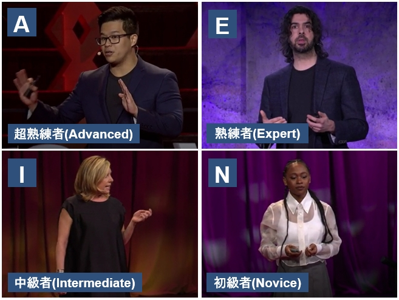

# プロジェクト名
　数理人材育成協会HRAM(Human Resource Association of Mathematics)主催の
AIエキスパート人材育成コースで実施したスピーチ動作の評価モデル研究の成果である。
本コースではロボティックス関連の高野研究室に所属している。
本研究では、TEDサイトのスピーチ動画から話者の骨格座標及び音声を抽出し、
それら時系列データをAIモデルで処理することによりスピーチ動作の良し悪し判定を行うものである。
コース期間は2024年6月から約1年間であり最終的に学会及び公聴会での発表が必須である。 

## プログラム及びデータ概要
<11_データセット作成> 
11a_Movenet_mp4topnkp.py：mp4動画からmovenetで骨格座標を抽出する 
11b_pnkp+Audio.py：mp3から音声データを抽出しフレーム同期させる 
11c_10sec_samples.py：骨格座標と音声データのテーブルから特定条件の10秒間のデータを抽出する 
12a_XXsec_samples.py：骨格座標と音声データのテーブルから特定条件(*1)の連続秒数最大のデータを抽出する 
12b_1secSW_samples.py：一連連続データサンプルからスライディングウィンドウ(1秒)サンプルを作成 
12c_XsecSW_samples.py：一連連続データサンプルからスライディングウィンドウサンプルを作成 
13a_LeftWrist_fixed.py：左手首固定のMovenet骨格座標データ作成 
13b_RightWrist_fixed.py：右手首固定のMovenet骨格座標データ作成 
13c_BothWrists_fixed.py：両手首固定のMovenet骨格座標データ作成 
13d_AudioStrength_fixed.py：音声データ固定の時系列データ作成、骨格座標はそのまま 
15a_Dataset_download.py:データセットダウンロード 
<21_学習評価> 
21_transformer_encoder.py：4値分類学習、評価 
<設定ファイル:data2> 
conf.csv：動画mp4データのフレームレート 
label.csv：学習データラベル 
results.csv：テストデータラベル 

## 入力データセット
関連リンク記載のHuggingFaceにデータセットが格納されている。 
プログラムにより、フォルダcsv_recoveredに下記フォルダが作成されてcsvファイルがダウンロードされる。 
※実行前に、HuggingFaceのトークンをHUGGINGFACE_HUB_TOKENへ設定しておく。 
フォルダcsv_recoveredをフォルダdata_csvへリネームする。 
学習データ(train[7054サンプル]/test[255サンプル]) 
評価データ(eva[63サンプル]) 
学習データにはデータ増強サンプルも全て含まれている。 

## 動作環境
- Windows / Python(Anaconda等)など

## 基本的な使い方
(0)ビデオデータmp4のダウンロード 
TED talkサイトからスピーチ動画をダウンロードして640x480の動画へリサイズする。 
※TED動画は非営利目的であれば無償で利用可能である。 
スピーチ動画mp4に対してMovenetモデルにより骨格座標時系列データを取得する。 
並行して同動画mp4に対して音声強度mp3を取得し上記骨格座標とフレーム同期させる。 

(1)コアサンプルの作成 
スピーチ動画毎の上記骨格座標＋音声強度時系列データから上半身10秒の 
コアサンプルデータを抽出する。サンプルデータ数は996。 

(2)サンプルデータ増強 
以下の2種類の方法によりサンプルデータの増強を図る。 
これらデータ増強によりデータ数は7054まで増加する。
- スライディングウィンドウ(SW) 
  ウィンドウ時間分だけスライドさせたデータを作成する。 
  例えば対象期間が15.6秒の場合、10秒サンプルは1サンプルしかえられないが、 
  SWを適用すれば、int(15.6-9) = 6サンプル作成可能である。 
- データ加工(非活性化)  
  熟練者の動画の左右手首や音声を非活性化することにより、中級者/初級者のサンプルを作成する。 

(3)4値分類学習 
深層学習モデルtransformerのデコード部をベースとした4値分類モデルを使用する。 
4値は、A:Advanced(超熟練者),E:Expert(熟練者),I:Intermediate(中級者),N:Novice(初級者)である。 
教師有り学習として作者によりA,E,I,Nのラベル付けが実行されている。 
データセットのcsvファイルは、17の骨格座標と音声強度の18次元240フレーム(10秒)から構成される。 
骨格座標は、左右肩/肘/手首のX,Y座標と、鼻と左右目/耳のX座標の17種類からなる。 
前者は主に手の動作を、後者は主に顔向き(アイコンタクト)の特徴抽出に使用されることを期待している。 

(4)評価 
上記(3)で学習したモデルは、評価モデルとして使用することが可能である。 
train/testデータによる4値分類学習プログラムの最後で、evaデータによる評価を行う。 
evaデータは63サンプル(11,11,13,13,15サンプルの5つのスピーチ)から構成される。 

## 出力ファイルと保存先
上記(4)評価を実行した結果の例を以下のファイルに出力される。 
<出力ファイル:data2> 
predict_eva.csv：評価結果出力結果 
出力ファイルには、4値分類の予測と、その予測の確信度合いが出力される。 
確信度合いに重みを掛けて点数付けをすることが可能である。 

## フォルダ構成

  
ディレクトリ構成を開く

実行フォルダ/ 
├─ data_csv/ 
│  ├─ train/ 
│  ├─ test/ 
│  └─ eva/ 
├─ docs/ 
│  └─ images/ 
│     ├─ overview.jpg 
│     └─ ... 

## ファイルサイズ
データセット：322MB 

## 関連リンク
HRAM 
https://hram.or.jp/guidance/ 
TEDトークサイト 
https://www.ted.com/talks 
データセット格納サイト 
https://huggingface.co/datasets/Amouri28/hram-speech-coach-dataset 

## 注意事項
特になし

